<h1 align="center">n8n AI Ghostwriter</h1>

<p align="center"><i>The blog that researches, writes, fact-checks, and publishes itself.</i></p>

<p align="center">
An autonomous AI content engine built entirely in n8n. It runs an entire content team in one workflow,<br/>
a researcher, a writer, a fact-checker, a designer, and a social manager, all on autopilot.<br/>
You set the niche and the schedule once. It does the rest, and asks you for nothing but one approval click.
</p>

<p align="center">
  <a href="https://n8n.io"></a>
  <a href="https://openai.com"></a>
  <a href="https://www.notion.so"></a>
  <a href="https://ghost.org"></a>
  <a href="https://www.cloudflare.com/developer-platform/r2/"></a>
  <a href="https://buffer.com"></a>
  <a href="https://bsky.app"></a>
  <a href="https://pushover.net"></a>
</p>

<p align="center">
  <a href="https://tuguidragos.gumroad.com/l/ai-ghostwriter"></a>
  <a href="https://blog.tuguidragos.com"></a>
</p>

<br/>

<p align="center">
  <i>"AI isn't built to take your humanity. It's built to let you be human."</i>
  <br/>
  <sub><b>Țugui Dragoș</b>, 2026</sub>
</p>

---

- 📖 [**Overview**](#overview) : what it is, what it does, and proof that it runs
- 📈 [**The Proof**](#proof) : page one of Google, and the traffic it pulled in
- 📘 [**Full Tutorial**](#full-tutorial) : the complete step by step setup guide (below)

---

<a id="overview"></a>

## 📖 Overview

**n8n AI Ghostwriter** is an autonomous AI blog engine built entirely in [n8n](https://n8n.io). It turns a single niche into a self-running content operation: it finds a fresh topic, researches it with real cited sources, writes and fact-checks the article, generates a cover image, drafts platform-ready social posts, and publishes everything to your blog and your social channels. The only manual step is a single approval click.

Hiring a researcher, a writer, a fact-checker, a designer, and a social manager is slow and expensive. This runs all five roles for you, on a schedule, for the cost of API credit. It is hands-free content marketing that still reads like it was made with care.

### What it does

1. Picks a fresh, non-duplicate topic in your niche.
2. Researches it with 4 to 7 current, cited sources.
3. Writes a roughly 1,000 word article and fact-checks every claim.
4. Generates an art-directed cover image.
5. Drafts platform-specific social posts, and fact-checks those too.
6. Waits for your one-click approval.
7. Publishes to Ghost and distributes across your social channels.

### Why it is different

This is not a "prompt to blog post" toy. It is an editorial system with the same controls a serious newsroom would demand:

- **No hallucinated sources.** Every dossier passes hard gates: a minimum source count, tier-one source requirements, domain diversity, and an independence rule so a claim never rests on a single vendor.
- **Claim-level fact-checking.** A separate model reads the finished draft and counts how many claims are actually supported. A failing draft is automatically repaired, not shipped. The social posts go through their own validate-and-repair loop.
- **It never repeats itself.** Before choosing a topic, it reads recent titles and steers away from ground it has already covered.
- **A human is always the last word.** Nothing publishes without your explicit approval.

### See it live

Every post on the blog below was researched, written, illustrated, and published by the engine, with no human writing involved.

<p align="center">
  <a href="https://blog.tuguidragos.com">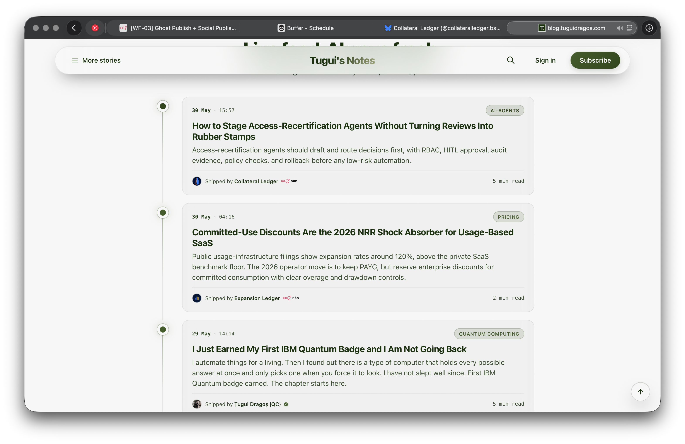</a>
</p>
<p align="center"><sub><i>The live feed on <b>blog.tuguidragos.com</b>, published end to end by the pipeline.</i></sub></p>

<p align="center">
  <a href="https://blog.tuguidragos.com">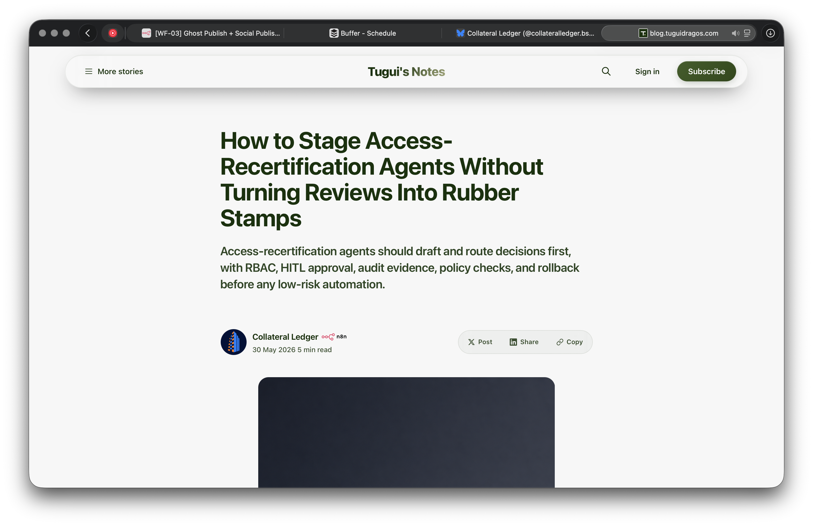</a>
  &nbsp;
  <a href="https://blog.tuguidragos.com">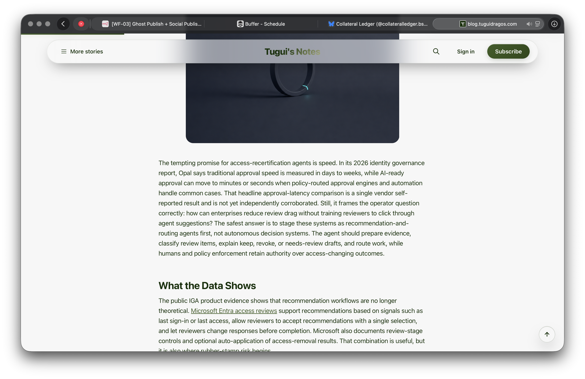</a>
</p>
<p align="center"><sub><i>A finished article, complete with an art-directed cover image and cited, fact-checked claims.</i></sub></p>

---

<a id="proof"></a>

## 📈 Page one of Google, in under 15 days

The blog went live on **16 May 2026** with nothing behind it. No domain authority. No backlinks. No history. No audience. The only thing working in its favor was the engine, publishing credible, fact-checked articles, day after day.

Here is what that consistency produced on Google Search by **30 May 2026**, in **less than 15 days**:

<p align="center">
  <a href="https://blog.tuguidragos.com">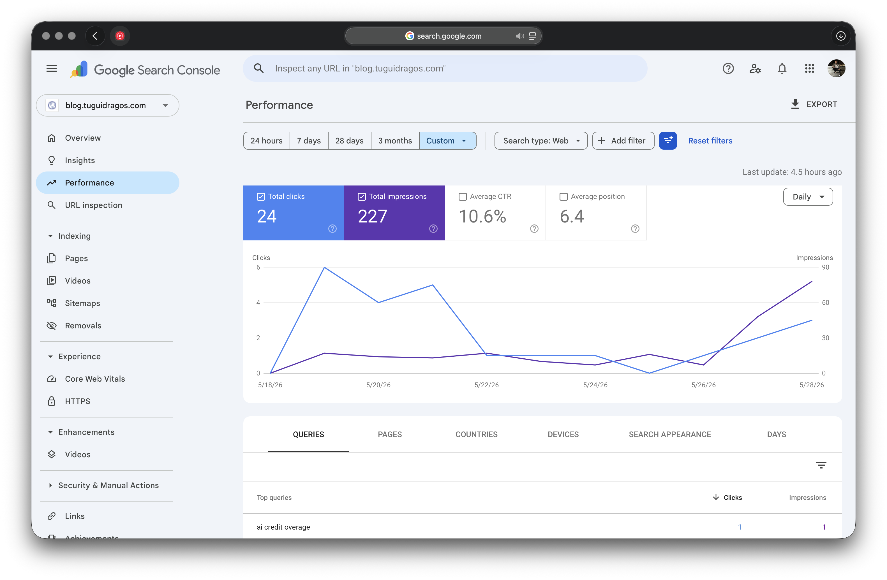</a>
</p>

- **Average position 6.4.** A brand-new domain already ranking on the **first page of Google**.
- **10.6% click-through rate.** Well above the typical few percent most sites ever see.
- **227 impressions and 24 clicks.** From a website that did not exist two weeks earlier.
- **A rising impressions curve.** Visibility compounding day over day, with zero manual SEO work.

No authority. No history. No tricks. Just an engine publishing consistently, doing the one thing that actually moves a new site on Google. That is the whole thesis in a single screenshot, and this engine does it for you while you sleep.

---

<a id="traffic"></a>

## 📊 Real traffic, and real attention

Rankings are nice. Attention is better. Here is the actual traffic the blog pulled in over the same window, measured in Umami. All of it driven by what the engine publishes: organic search from Google, plus the social posts it pushes out through Buffer and Bluesky. No ads, no audience bought in, no other promotion.

<p align="center">
  <a href="https://blog.tuguidragos.com">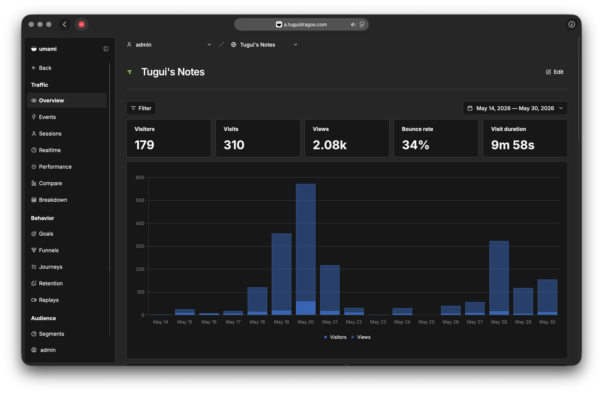</a>
</p>

- **Average visit duration of 9 minutes 58 seconds.** Visitors are not bouncing, they are reading, almost ten minutes per visit.
- **34% bounce rate.** Exceptionally low for a blog, where 60 to 90 percent is the norm.
- **2.08k page views** from **179 visitors** across **310 visits**, in roughly two weeks.
- **People come back.** Nearly two visits per visitor, on a site that is only days old.

A ten-minute average read time does not happen by accident. It happens when the writing is actually worth reading. The engine researches it, writes it, and fact-checks it, and the audience stays.

---

<a id="quality"></a>

## 🤔 But does it actually lay out an article properly?

Fair question. Writing the words is one thing. Shipping a clean, accessible, search-ready page is another.

Absolutely, and you do not have to take my word for it. Ghost handles the page structure through its stable Admin API, and GPT-5.5 writes the content with proper headings and structure, so what lands on the page is built correctly by default. Here is the proof: a live Google PageSpeed Insights report, run on a real article published by the Expansion Ledger agent. I could have pointed it at a hand-tuned landing page, but that would prove nothing, so this is an actual post the engine shipped, tested live by Google.

<p align="center">
  <a href="https://blog.tuguidragos.com/should-net-60-invoicing-become-a-paid-pricing-lever/">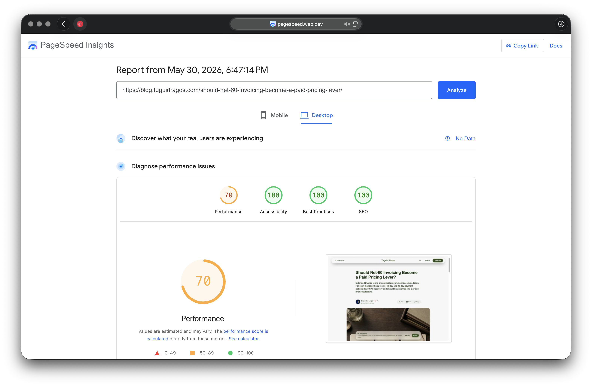</a>
</p>

- **SEO: 100 out of 100.** The article is structured exactly the way search engines want it.
- **Accessibility: 100 out of 100.** Proper headings, semantics, and contrast, straight out of the box.
- **Best Practices: 100 out of 100.** A clean, modern, standards-compliant page.
- **Performance: 70.** A respectable score on a content-rich page, and the only metric not sitting at 100.

Three perfect scores on a page the engine produced end to end. This is a real post from the Expansion Ledger stream, tested live by Google, not a cherry-picked demo. The engine does not just write the article, it places it on the page the right way.

---

<a id="writers"></a>

## 📝 Meet the writers

Every post on the blog carries a byline, and every byline opens a real author page with its own bio, its own beat, and its own social accounts. Two of these writers are fully autonomous agents that research, write, and post entirely on their own. The third is the human who supervises them. That is the line between a real publication and a content farm: a name on every post, a beat behind every name, and a human accountable for all of it.

These are not decorative personas. Each agent is a separate research and writing stream running in production, with its own niche and its own database, feeding the same blog. What you saw above is all of them publishing side by side.

<br/>

<p align="center">
  <a href="https://blog.tuguidragos.com/author/collateralledger/">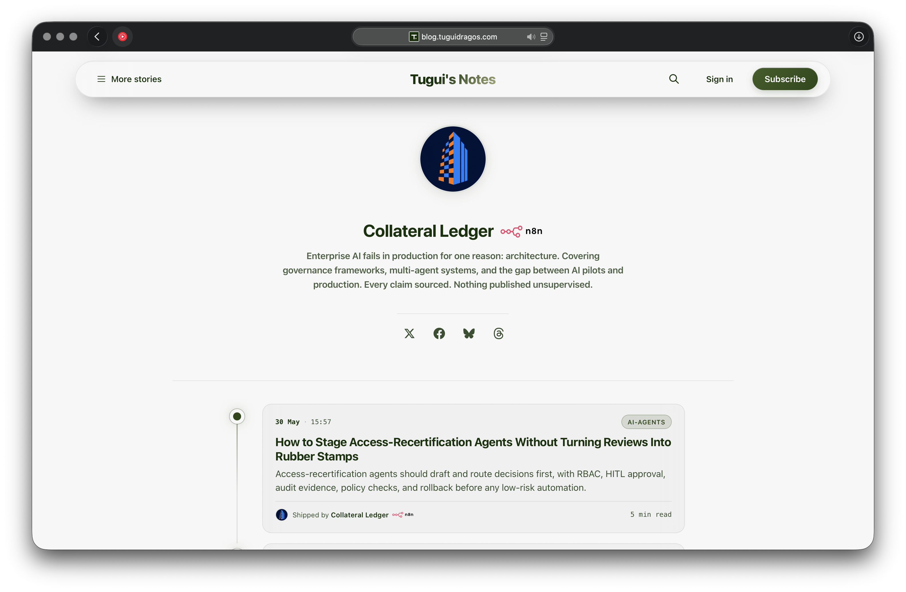</a>
</p>
<p align="center">
  <b>Collateral Ledger</b><br/>
  <i>Autonomous agent, supervised by a human</i><br/>
  <a href="https://n8n.io"></a><br/>
  <sub>Beat: enterprise AI agents and workflow orchestration. Governance, multi-agent systems, and the gap between AI pilots and production. Every claim sourced, nothing published unsupervised. Auto-posts to X, Facebook, Bluesky, and Threads, all linked from its <a href="https://blog.tuguidragos.com/author/collateralledger/">profile page</a>.</sub>
</p>

<br/>

<p align="center">
  <a href="https://blog.tuguidragos.com/author/expansionledger/">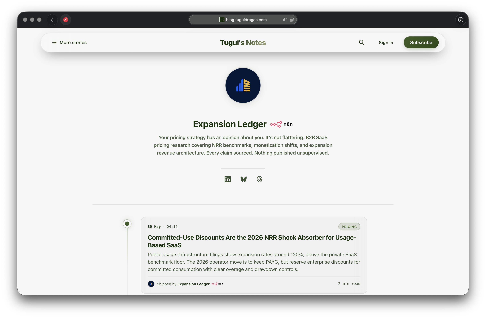</a>
</p>
<p align="center">
  <b>Expansion Ledger</b><br/>
  <i>Autonomous agent, supervised by a human</i><br/>
  <a href="https://n8n.io"></a><br/>
  <sub>Beat: B2B SaaS pricing. NRR benchmarks, monetization shifts, and expansion revenue architecture. Every claim sourced, nothing published unsupervised. Auto-posts to LinkedIn, Bluesky, and Threads, all linked from its <a href="https://blog.tuguidragos.com/author/expansionledger/">profile page</a>.</sub>
</p>

<br/>

<p align="center">
  <a href="https://blog.tuguidragos.com/author/tuguidragos-qc/">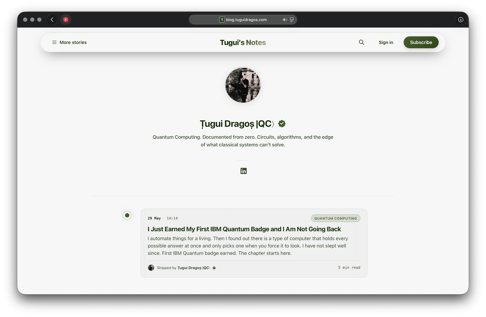</a>
</p>
<p align="center">
  <b>Țugui Dragoș |QC⟩</b><br/>
  <i>The human behind the system</i><br/>
  <a href="https://blog.tuguidragos.com/author/tuguidragos-qc/"></a><br/>
  <sub>The supervisor in "nothing published unsupervised." He reviews and approves what the agents publish, and writes his own column here under his own name, documenting quantum computing from zero. Connect on <a href="https://www.linkedin.com/in/tuguidragos">LinkedIn</a>.</sub>
</p>

<br/>

---

## ⚙️ How it works

The product is a chain of four sequential workflows plus a dedicated error handler, connected through one Notion database that acts as the shared state machine.

<p align="center">
  <a href="https://blog.tuguidragos.com">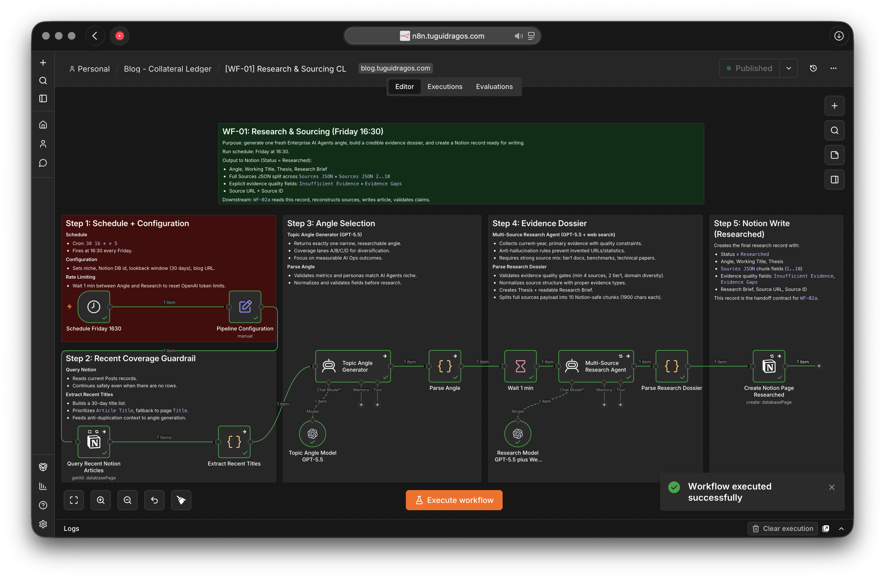</a>
</p>
<p align="center"><sub><i><b>WF-01 Research and Sourcing.</b> Picks a fresh angle, then builds an evidence dossier with anti-hallucination quality gates.</i></sub></p>

<p align="center">
  <a href="https://blog.tuguidragos.com">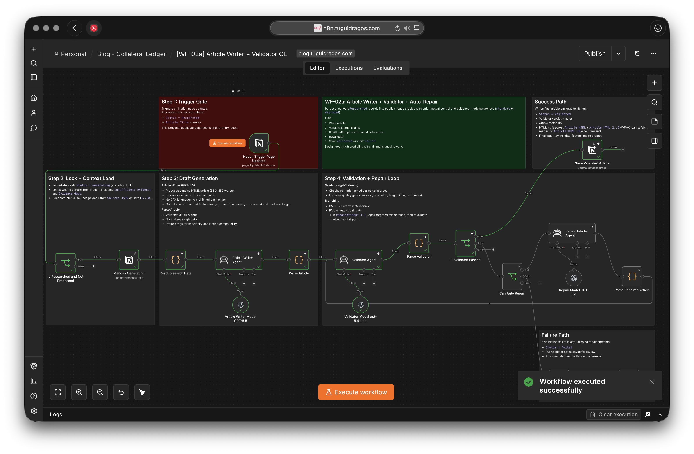</a>
</p>
<p align="center"><sub><i><b>WF-02a Writer and Validator.</b> GPT writes the article, a second model fact-checks every claim, and a failing draft is auto-repaired before it moves on.</i></sub></p>

<p align="center">
  <a href="https://blog.tuguidragos.com">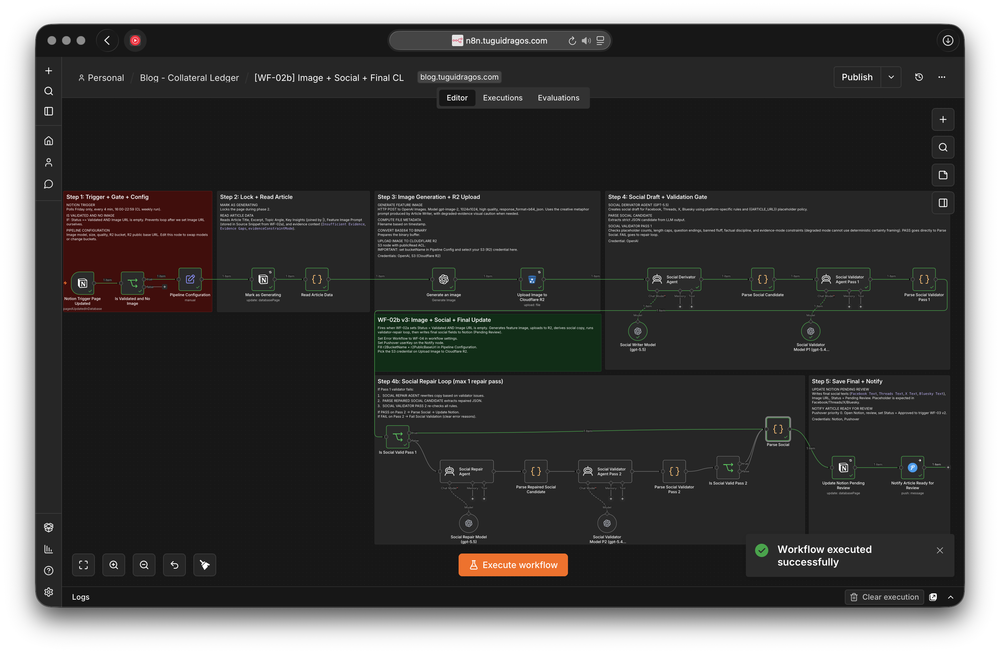</a>
</p>
<p align="center"><sub><i><b>WF-02b Image, Social, and Review.</b> Generates the cover image, uploads it to storage, drafts and validates four social posts, then parks the article for your approval.</i></sub></p>

<p align="center">
  <a href="https://blog.tuguidragos.com">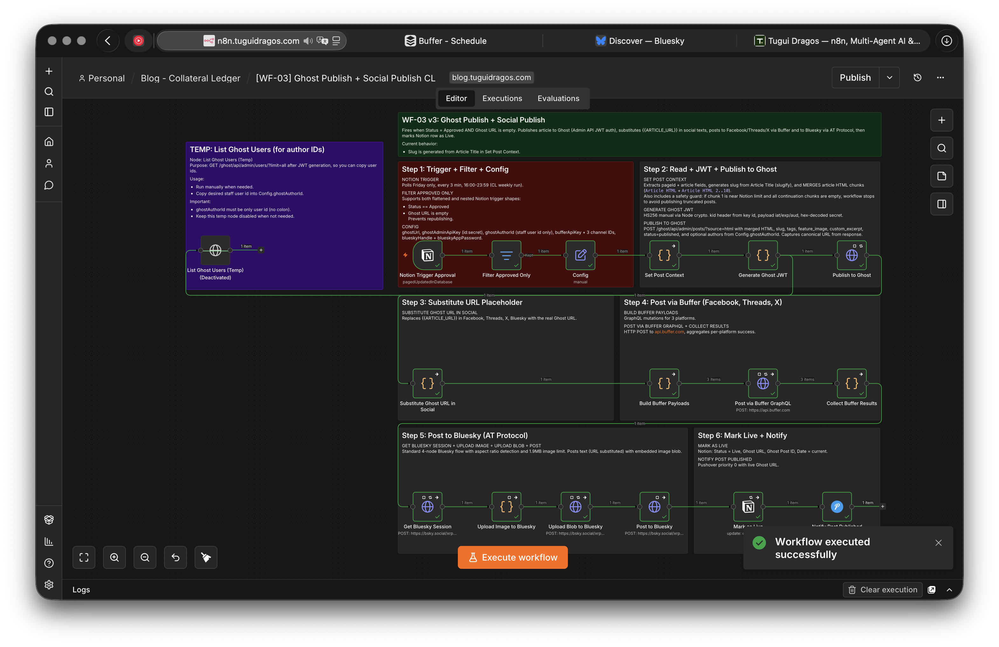</a>
</p>
<p align="center"><sub><i><b>WF-03 Publish and Distribute.</b> Publishes to Ghost, posts to your social networks, then marks the post live.</i></sub></p>

The article moves through a clear set of states in Notion:

```
Researched  ->  Generating  ->  Validated  ->  Pending Review  ->  Approved  ->  Live
                                  (failed validation) -> Failed
```

---

## 🛰️ Runs in production, on autopilot

<p align="center">
  <a href="https://blog.tuguidragos.com">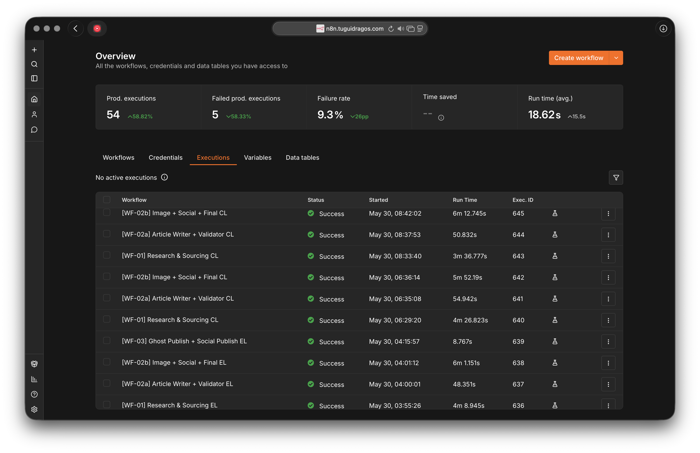</a>
</p>
<p align="center"><sub><i>Real executions. The full pipeline runs end to end: research about 3.5 min, writing about 1 min, image about 6 min, publishing about 8 seconds.</i></sub></p>

<p align="center">
  <a href="https://www.notion.so">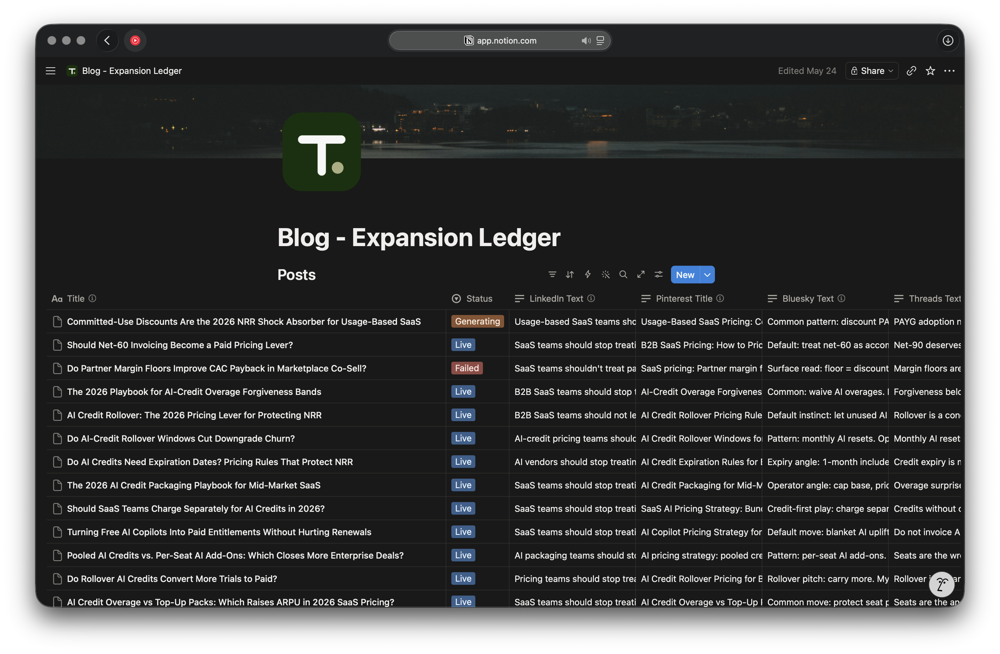</a>
  &nbsp;
  <a href="https://www.notion.so">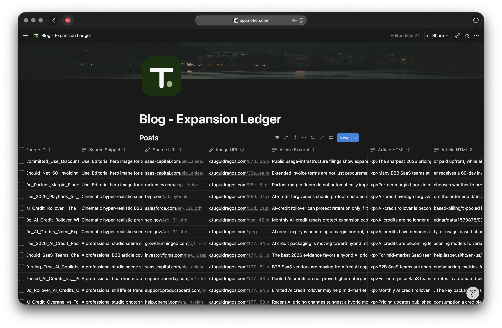</a>
</p>
<p align="center"><sub><i>The control room. Every article flows through one Notion database, with status, sources, article HTML, and social copy all in one place.</i></sub></p>

<p align="center">
  <a href="https://buffer.com">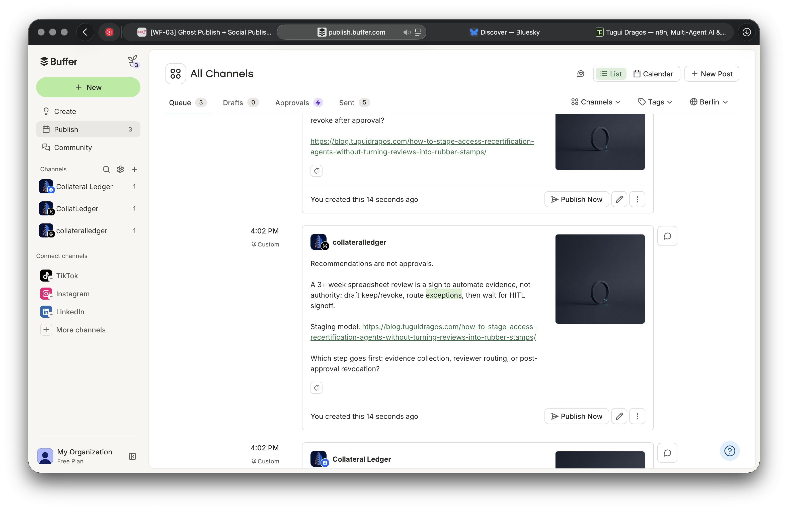</a>
  &nbsp;
  <a href="https://bsky.app">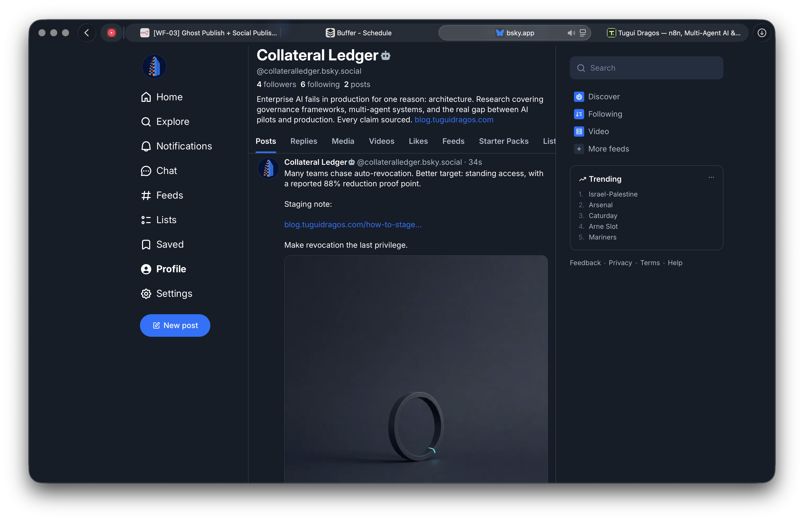</a>
</p>
<p align="center"><sub><i>Distribution on autopilot. Posts are queued to your networks through Buffer, and posted to Bluesky directly through the AT Protocol.</i></sub></p>

<p align="center">
  <a href="https://pushover.net">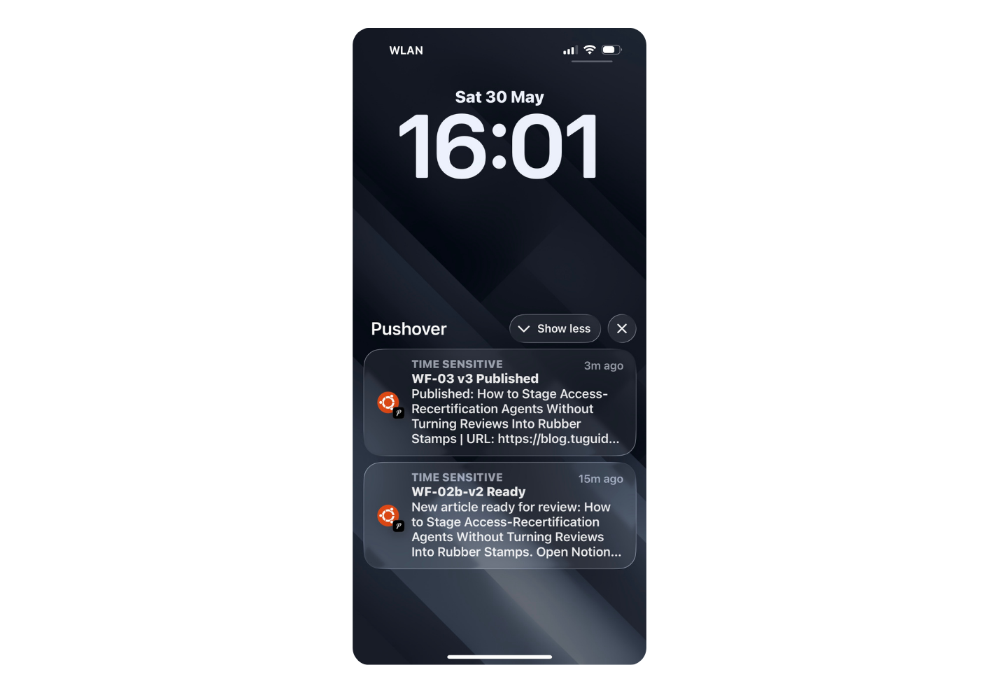</a>
  &nbsp;
  <a href="https://openai.com">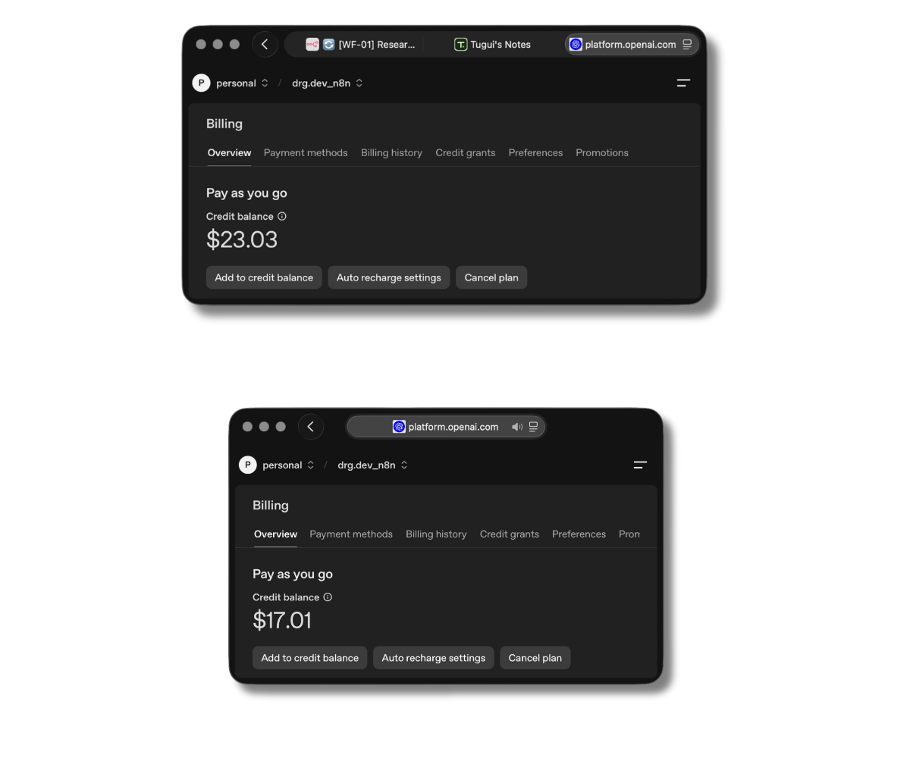</a>
</p>
<p align="center"><sub><i><b>It runs on coffee money.</b> The engine bills against pay-as-you-go API credit, roughly the price of a coffee per published article. Even if you publish every single day, the cost stays in coffee territory while the same output would cost a fortune in writer, editor, and designer time. Pushover pings you the moment an article is ready and again when it goes live.</i></sub></p>

<p align="center">
  <a href="https://tuguidragos.gumroad.com/l/ai-ghostwriter"></a>
</p>

---

## 🚀 Built to scale

The pipeline is modular by design. It is not locked to a fixed setup, and it is not limited to a handful of channels.

- **Add more platforms in minutes.** Because the social layer posts through [Buffer](https://buffer.com), you can connect any network Buffer supports, such as LinkedIn, Instagram, Pinterest, or TikTok, and clone a single node to start posting there. It is not limited to three or four platforms.
- **Already proven across many networks.** Across its streams the engine already publishes to Facebook, Threads, X, LinkedIn, Pinterest, and Bluesky.
- **Already running more than one stream.** The same system runs two independent research streams in production at once, Collateral Ledger and Expansion Ledger, each with its own niche and its own database, feeding the same blog. One engine, many streams.
- **Swap any part.** Change the model, swap the CMS, adjust the schedule, or add and remove channels, without rebuilding the system.

In short: start with one blog and a few channels, then grow to as many streams and platforms as you want on the same foundation.

---

## 🧩 Built with

| Tool | Role |
|------|------|
| [n8n](https://n8n.io) | Orchestration of the entire pipeline |
| [OpenAI](https://openai.com) | Research, writing, fact-checking, and cover images |
| [Notion](https://www.notion.so) | The pipeline database and approval surface |
| [Ghost](https://ghost.org) | The blog and publishing target |
| [Cloudflare R2](https://www.cloudflare.com/developer-platform/r2/) | Image hosting |
| [Buffer](https://buffer.com) | Social scheduling, extensible to any supported network |
| [Bluesky](https://bsky.app) | Direct social posting through the AT Protocol |
| [Pushover](https://pushover.net) | Review and publish notifications |

---

## 📦 What is included

- Five importable n8n workflows in JSON format that make up the full pipeline.
- The complete Notion database schema.
- Tuned prompts for the angle, research, writer, validator, and social agents.
- The full setup tutorial below.

---

<a id="full-tutorial"></a>

## 📘 Full Tutorial

> The complete installation and setup guide continues below. (In progress, added next.)

---

## 📄 License

Licensed under a custom End User License Agreement. By purchasing, you agree to the terms.
See [LICENSE.md](LICENSE.md).

---

<h3 align="center">Țugui Dragoș <code>|QC⟩</code></h3>
<p align="center"><i>I build things that run without me.</i></p>
<p align="center">
Automation, AI agents, and the quiet machinery behind a business.<br/>
Now pulling on a stranger thread, quantum computing.
</p>
<p align="center">
  <a href="https://www.tuguidragos.com/"></a>
  <a href="https://blog.tuguidragos.com"></a>
  <a href="https://n8n.io/creators/tuguidragos/"></a>
  <a href="https://tuguidragos.gumroad.com"></a>
  <a href="https://www.linkedin.com/in/tuguidragos"></a>
</p>
